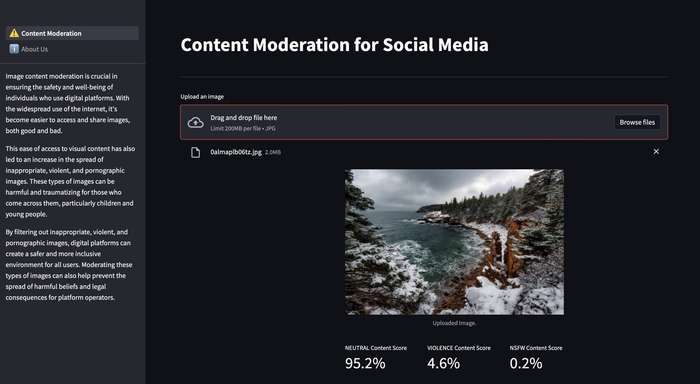

# Content Moderation for Social Media

**Project by Andrew Bonafede, Shrey Gupta, and Shuai Zheng for Duke AIPI 540 Computer Vision Module**

## Content Moderation for Social Media (Streamlit App):
A streamlit based web application which provides you the ability to upload an image and get the probability of the image being a neutral, nsfw or violence image. 
>

&nbsp;
## Running the Code

**1. Clone the repository**
```
git clone https://github.com/guptashrey/Content-Moderation-for-Social-Media.git
```
**2. Switch to the 'st' branch**
```
git checkout st
```
**3. Create a conda environment and activate it:** 
```
conda create --name st_env python=3.8
conda activate st_env
```
**4. Install requirements:** 
```
pip install -r requirements.txt
```
**5. Run the application**
```
streamlit run 1_⚠️_Content_Moderation.py
```